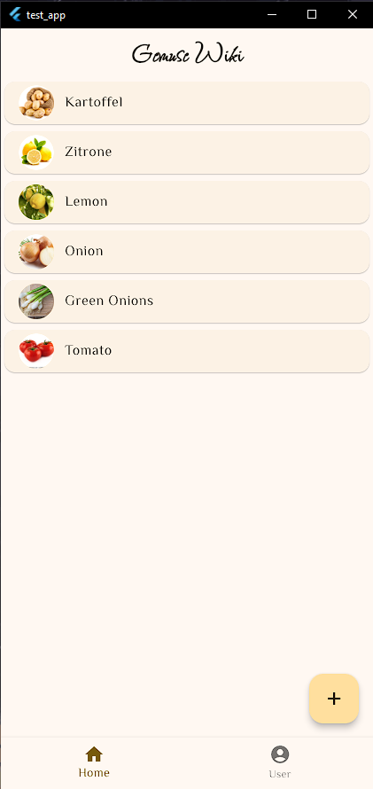
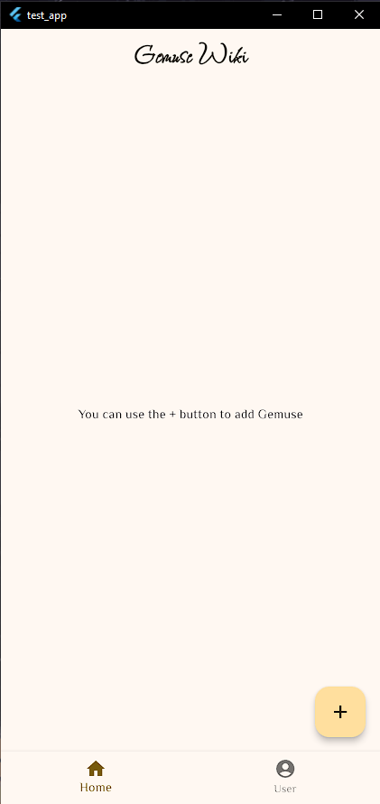
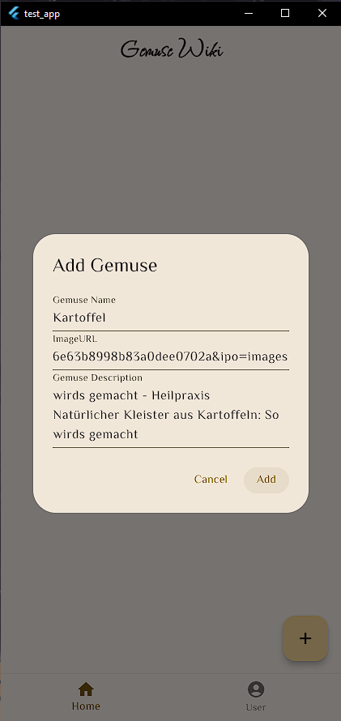
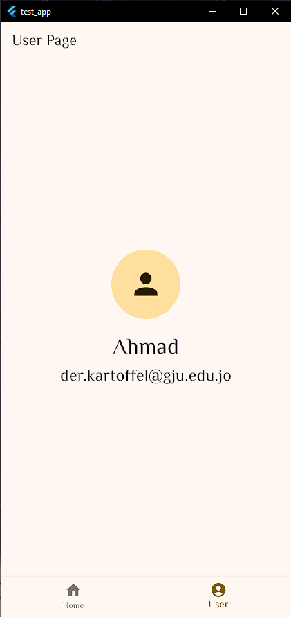
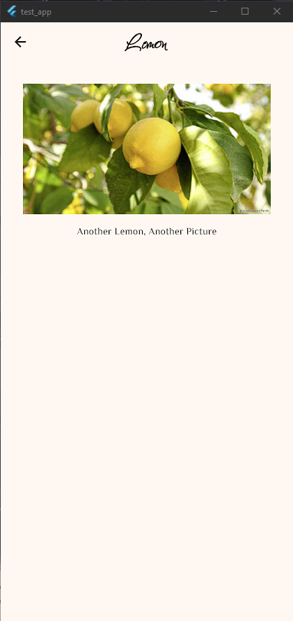

# L1B Certificate Example App

## Screenshots

Screenshots

This is an Example App to get an idea of what to build to get the Certificate of Completion for the GJU IT Club [Das Bootcamp](https://it.gju.app/events/bootcamp).

## Rules & Instructions
- Create an App that has the following stuff:
  - 2 Pages: Home & User
  - **Home**
    - has a floating action button (FAB), the body is displayed initially with a text 

